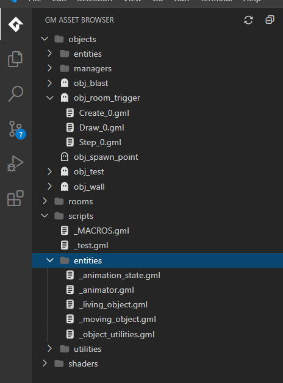

# GameMaker Studio 2 in Visual Studio Code

Using this extension will give you a mini GameMaker asset browser right in VS Code. Only code related things will show up.

If you want to create files you'll still have to do that in GameMaker, this is mostly to replace the code editor in GameMaker.

## Setup

I don't feel like publishing this, so you'll have to insall the extension using the included .vsix file.

Once the extension is installed as long as your current directory, or any of it's children, contain a .yyp file it should just work. You will see a tab on the left with the GameMaker logo. That's where you can view and edit GameMaker related code files.

## Thanks

* If you're looking for a more involved extension with more features you might wanna check out: https://github.com/sanbox-irl/gm-code-vsc
* Thanks to https://jam-icons.com/ for the icons used in this extension.
